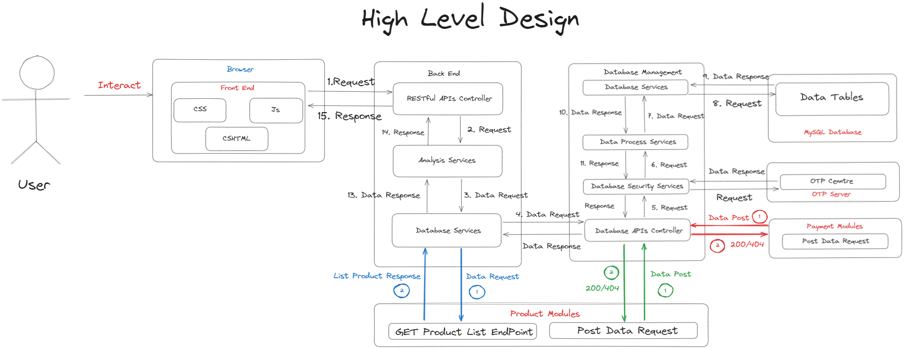
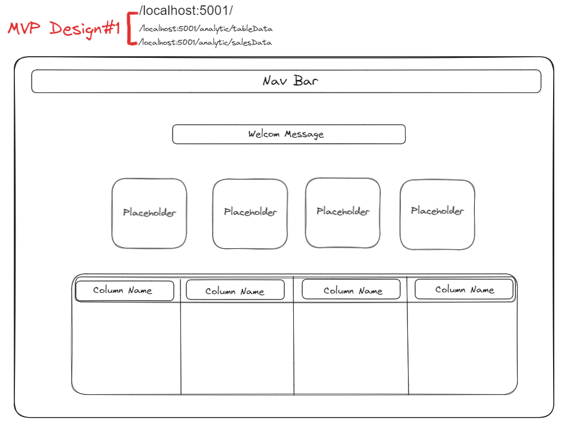
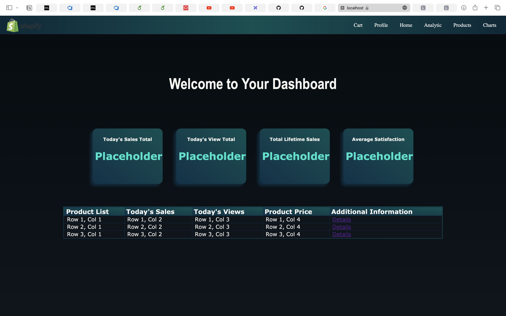
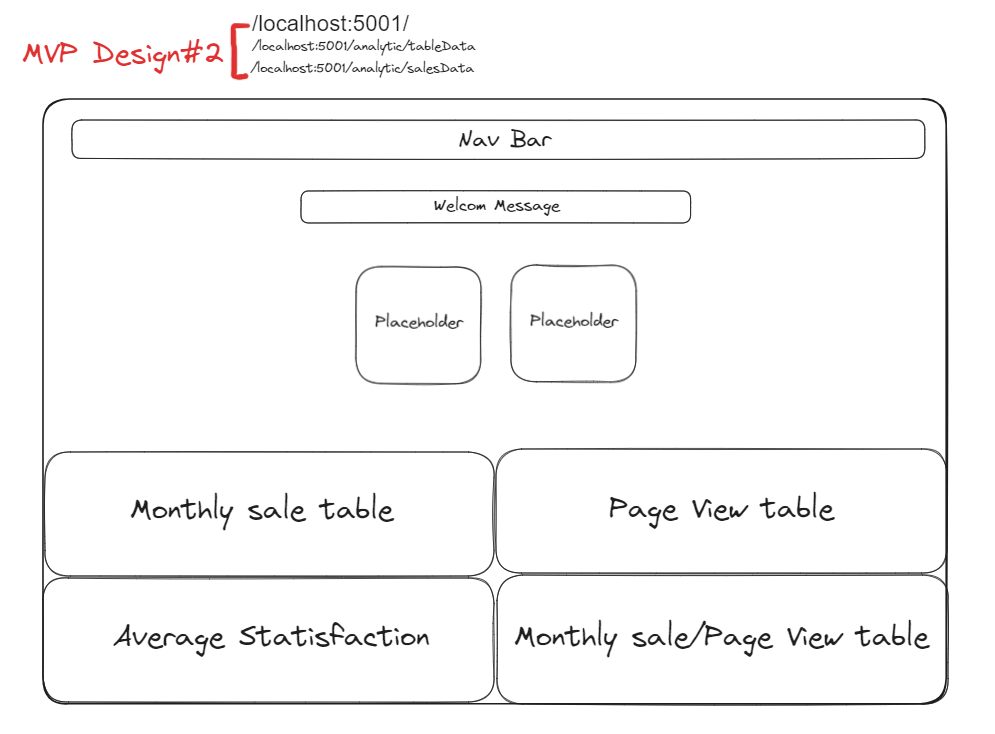
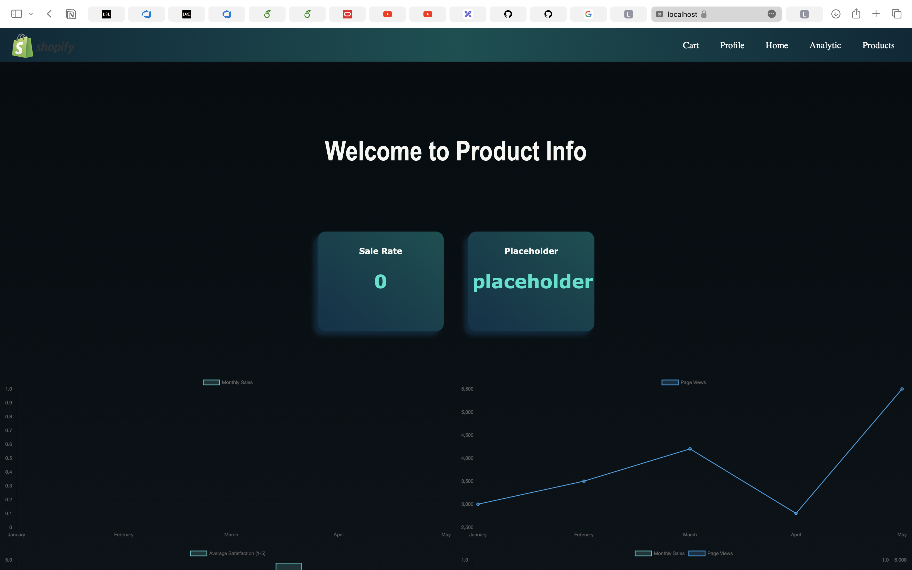
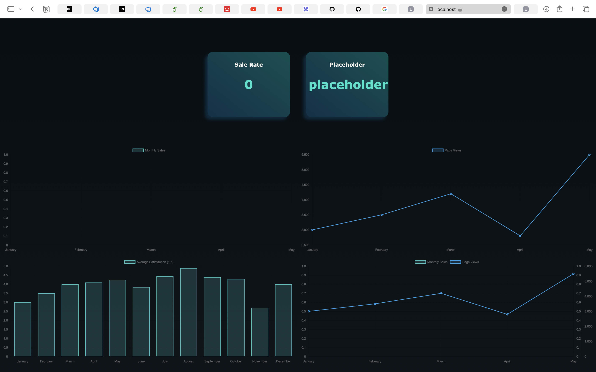

# CSCN73030_Project_Advanced_Software

The functional overview of our analytics dashboard module provides a comprehensive insight into various key performance metrics for our website. This dashboard is a powerful tool to monitor and analyze the performance and success of our online presence. By leveraging the dashboard's data and insights, we can make informed decisions to drive our business's growth and success.

### I. Analytics and Report Module Services

> <details><summary><strong> 1. Unique Visitors </strong></summary>
>
> This metric represents the total number of distinct individuals who visited the site within a specified period. By tracking this, we can gauge the reach and popularity of our website among different segments of users. Understanding the behavior and preferences of our unique visitors allows us to tailor our strategies and content to engage better and retain our audience.

</details>

> <details><summary><strong> 2. Page Views </strong></summary>
>
> Understanding which pages receive the most attention is crucial for optimizing our website's content and layout. We can identify our website's most engaging and valuable sections by analyzing page views. This information helps us prioritize our efforts in creating compelling and relevant content that resonates with our audience, ultimately driving higher engagement and conversion rates.

</details>

> <details><summary><strong> 3. Total Sales </strong></summary>
>
> This metric gives us a snapshot of gross revenue over a specific timeframe. By monitoring total sales, we can assess the overall financial health of our business and identify periods of high or low sales activity. This information is invaluable for making informed decisions about pricing strategies, inventory management, and marketing campaigns to maximize revenue and profitability.

</details>

> <details><summary><strong> 4. Average Order Value (AOV) </strong></summary>
>
> Knowing how much customers spend per order is essential for strategic pricing decisions. By analyzing the average order value, we can identify opportunities to increase revenue by encouraging customers to spend more. This could involve offering bundled products, upselling or cross-selling, or implementing loyalty programs to incentivize higher-order values.

</details>

> <details><summary><strong> 5. Best Category Analysis </strong></summary>
>
> To maximize profits, it is essential to identify the most popular and profitable product categories. We can focus on promoting and expanding these categories by conducting a best-category analysis. This may involve optimizing marketing campaigns, improving product assortment, or enhancing the overall customer experience within these categories to drive sales and revenue further.

</details>

> <details><summary><strong> 6. Time Analysis </strong></summary>
>
> Sales trends can vary throughout the year, and understanding these patterns is crucial for effective planning and resource allocation. We can identify seasonal trends and adjust our strategies by conducting time analysis. This allows us to allocate resources more efficiently, optimize inventory levels, and tailor marketing efforts to capitalize on peak seasons or mitigate dips in sales during slower periods.

</details>

> <details><summary><strong> 7. Feedback/Stars Analysis </strong></summary>
>
> Customer feedback is invaluable for making data-driven decisions on product recommendations. By analyzing feedback and star ratings, we can identify areas for improvement and make informed decisions on product development and marketing. This information helps us enhance product quality, address customer concerns, and build stronger relationships with our audience.

</details>

> <details><summary><strong> 8. Conversion Rate by Product </strong></summary>
>
> Understanding which products have the highest conversion rate is essential for optimizing our product offerings. We can identify top-performing products by analyzing the conversion rate by product and prioritize resources accordingly. This allows us to allocate marketing budgets, inventory space, and other resources to products with higher conversion rates, driving overall sales and profitability.

</details>

> <details><summary><strong> 9. Price Analysis </strong></summary>
>
> Comparing product price ranges is essential for ensuring competitive pricing and maximizing profitability. We can identify opportunities to adjust prices and improve our pricing strategy by conducting a price analysis. This could involve analyzing price elasticity, benchmarking against competitors, or implementing dynamic pricing strategies to optimize revenue and maintain a competitive edge.

</details>

> <details><summary><strong> 10. Sales Analysis </strong></summary>
>
> Prioritizing products based on sales and customer feedback can help us optimize our portfolio. We can identify top-selling products and allocate resources by conducting a sales analysis. This allows us to focus on higher-demand products, optimize inventory levels, and streamline operations to meet customer expectations and preferences.

</details>

> <details><summary><strong> 11. Profit and Loss </strong></summary>
>
> To comprehensively understand our business's financial health, analyzing the detailed breakdown of revenues and expenses is essential. By conducting a profit and loss analysis, we can identify areas of improvement and optimize our business operations. This includes identifying cost-saving opportunities, optimizing pricing and discount strategies, and refining our business model to drive profitability and sustainable growth.

</details>

---

### II. Table of Contents

- [CSCN73030\_Project\_Advanced\_Software](#cscn73030_project_advanced_software)
  - [I. Analytics and Report Module Services](#i-analytics-and-report-module-services)
  - [II. Table of Contents](#ii-table-of-contents)
    - [1. Status Main Branch Deploy](#1-status-main-branch-deploy)
    - [2. Tech Stack](#2-tech-stack)
    - [3. High Level Module Design](#3-high-level-module-design)
    - [4. Endpoints](#4-endpoints)
    - [5. Analysis Report Services Data Structures](#5-analysis-report-services-data-structures)
      - [5.1 Group\_1\_Record\_Abstraction Abstract Class](#51-group_1_record_abstraction-abstract-class)
      - [5.2 Valid User Views Data Structure](#52-valid-user-views-data-structure)
      - [5.3 Website logs Data Structure](#53-website-logs-data-structure)
      - [5.4 Sales Transactions Data Structure](#54-sales-transactions-data-structure)
      - [5.5 Feedback Data Structure](#55-feedback-data-structure)
      - [5.6 ResponseData Data Request List From Product Module Data Structure](#56-responsedata-data-request-list-from-product-module-data-structure)
    - [6. MVP Designs](#6-mvp-designs)
      - [6.1 EndPoint 1: .root/Profile/{UserID}](#61-endpoint-1-rootprofileuserid)
      - [6.2 EndPoint 2: .root/analytics/Profile/{UserID}/charts/{productID}](#62-endpoint-2-rootanalyticsprofileuseridchartsproductid)
    - [7. Nuget Packages Install](#7-nuget-packages-install)

---

#### 1. Status Main Branch Deploy


---

#### 2. Tech Stack

- <strong> `Server`</strong>: [ASP.NET]() 6.0 Web API
- <strong> `Front-end`</strong>: CsHTML, JavaScript, CSS
- <strong> `Database`</strong>:<a href="https://github.com/NolanMM/Azure_MySQL_Database_Management"> Azure MySQL</a>

[Back To Top](#cscn73030_project_advanced_software)

---

#### 3. High Level Module Design

<p align="center">
  
</p>

[Back To Top](#cscn73030_project_advanced_software)

---

#### 4. Endpoints

<strong>.root:</strong> <https://sprint1deploymentgroup1.azurewebsites.net>

<details>
  <summary><strong>EndPoint 1: .root / Profile / { UserID }</strong></summary>
  <ul>
    <strong><li>1. GET -> https://sprint1deploymentgroup1.azurewebsites.net/Profile/{ UserID }</li></strong>
  </ul>
</details>

<details>
  <summary><strong>EndPoint 2: .root / analytics / Profile / {UserId} / charts / {productId}</strong></summary>
  <ul>
    <strong><li>1. GET -> https://sprint1deploymentgroup1.azurewebsites.net/analytics/Profile/{UserID}/charts/{productID}</li></strong>
  </ul>
</details>

---

#### 5. Analysis Report Services Data Structures

##### 5.1 Group_1_Record_Abstraction Abstract Class

```CSharp
    public abstract class Group_1_Record_Abstraction : Group_1_Record_Interfaces
    {
        public override string ToString()
    }
```

##### 5.2 Valid User Views Data Structure

```CSharp
    public class UserView : Group_1_Record_Abstraction
    {
        public int UserView_ID { get; set; }
        [Required]
        public string User_ID { get; set; }
        [Required]
        public string Product_ID { get; set; }
        [Required]
        public decimal Time_Count { get; set; }
        [Required]
        public DateTime Date_Access { get; set; }

        public override string ToString()
    }
```

##### 5.3 Website logs Data Structure

```CSharp
    public class PageView : Group_1_Record_Abstraction
    {
        public int PageView_ID { get; set; }
        [Required]
        [MaxLength(45)]
        public string Page_Name { get; set; }
        [Required]
        [MaxLength(45)]
        public string Page_Info { get; set; }
        [Required]
        [MaxLength(45)]
        public string Product_ID { get; set; }
        [Required]
        public DateTime Start_Time { get; set; }
        [Required]
        [MaxLength(50)]
        public string UserID { get; set; }

        public override string ToString()
    }
```

##### 5.4 Sales Transactions Data Structure

```CSharp
    public class SaleTransaction : Group_1_Record_Abstraction
    {
        [Required]
        public string Transaction_ID { get; set; }
        [Required]
        public string User_ID { get; set; }
        [Required(ErrorMessage = "Order Value is required")]
        [Range(0.00001, double.MaxValue, ErrorMessage = "Required Order value > 0")]
        public decimal Order_Value { get; set; }
        [Required(ErrorMessage = "Date is required")]
        [DateNotDefault(ErrorMessage = "Date must be filled")]
        public DateTime date { get; set; }
        [Required(ErrorMessage = "The item list cannot be empty")]
        [MaxLength(10000)]
        public string Details_Products { get; set; }

        public override string ToString()
    }
```

##### 5.5 Feedback Data Structure

```CSharp
    public class Feedback : Group_1_Record_Abstraction
    {
        [Required]
        public int Feedback_ID { get; set; }
        [Required]
        [MaxLength(50)]
        public string User_ID { get; set; }
        [Required]
        [MaxLength(50)]
        public string Product_ID { get; set; }
        [Required(ErrorMessage = "Stars Rating is required")]
        public decimal Stars_Rating { get; set; }
        [Required(ErrorMessage = "Date is required")]
        [DateNotDefault(ErrorMessage = "Date must be filled")]
        public DateTime Date_Updated { get; set; }

        public override string ToString()
    }
```

##### 5.6 ResponseData Data Request List From Product Module Data Structure

```CSharp
    public class ResponseData
    {
        [JsonPropertyName("pid")]
        public string pid { get; set; } 

        [JsonPropertyName("sid")]
        public string sid { get; set; }

        [JsonPropertyName("name")]
        public string Name { get; set; }

        [JsonPropertyName("description")]
        public string Description { get; set; }

        [JsonPropertyName("image")]
        public string Image { get; set; }

        [JsonPropertyName("category")]
        public string Category { get; set; }

        [JsonPropertyName("price")]           
        public double Price { get; set; }

        [JsonPropertyName("stock")]
        public int Stock { get; set; }

        [JsonPropertyName("sales")]
        public int Sales { get; set; }

        [JsonPropertyName("rating")]
        public double Rating { get; set; }

        [JsonPropertyName("clicks")]
        public int Clicks { get; set; }

        public override string ToString()
    }
```

[Back To Top](#cscn73030_project_advanced_software)

---

#### 6. MVP Designs

##### 6.1 <strong>EndPoint 1: .root/Profile/{UserID}</strong>

<div style="display: flex;">
  <div style="flex: 50%; padding: 10px;">
    <strong>Design</strong>
    
  </div>
  <div style="flex: 50%; padding: 10px;">
    <strong>Preview</strong>
    
  </div>
</div>

##### 6.2 <strong>EndPoint 2: .root/analytics/Profile/{UserID}/charts/{productID}</strong>

<div style="display: flex; flex-direction: column;">
  <div style="padding: 10px;">
    <strong>Design</strong>
    
  </div>
  <div style="display: flex;">
    <div style="flex: 50%; padding: 10px;">
      <strong>Preview UI 1</strong>
      
    </div>
    <div style="flex: 50%; padding: 10px;">
      <strong>Preview UI 2</strong>
      
    </div>
  </div>
</div>

---

#### 7. Nuget Packages Install

- `MySqlConnector: 2.3.1`
- `Newtonsoft.Json: 13.0.3`

[Back To Top](#cscn73030_project_advanced_software)

---
